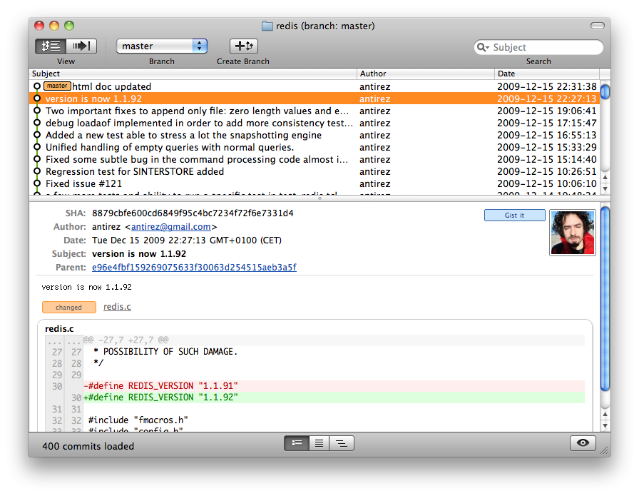
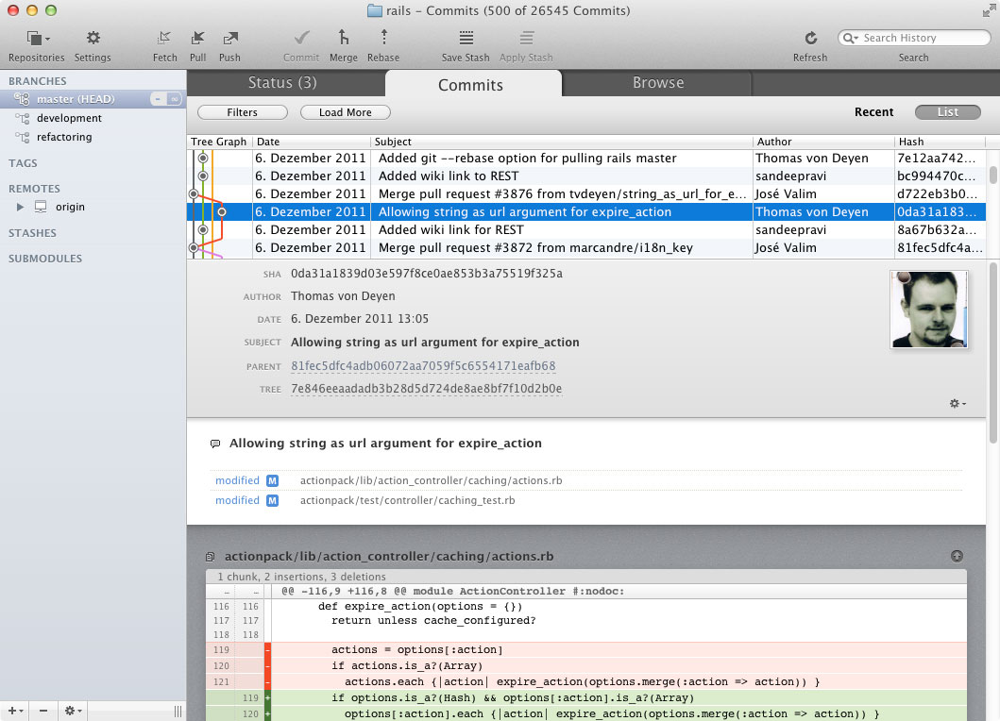

# 5 -- General workflow

## Adding some color to Git output

### Problem

Working in a terminal client with lots of output from programs such as
`git-status` and `git-log` makes your eyes hurt.

### Solution

Git can colorize its output to help you scan and parse its sometimes terse
output. This is most helpful in Git status output -- indiciting files that are
staged and unstaged -- and in diffs -- using color to indicate what was added
and what was removed.

You can configure Git to colorize output whenever it prints to the terminal (as
opposed to a pager or Unix pipe):

    git config --global color.ui true

You could also set it to `false` or `always`. The difference between `true` and
`always` is whether you want Git to be smart about not passing color codes to
other programs (`true`) or use it even when it is probably inconvenient
(`always`).

## Using a GUI

### Problem

You are having difficulty remembering all the Git commands and options, or you
find the text-based output from Git in a terminal client to be confusing.

### Solution

There are a number of graphical user interfaces available to work with Git
repositories. One graphical client comes bundled with Git and is called
`git-gui`. Running `git gui` will launch a simple one-window application that allows you to browse commits, diffs and write commits:

The looks of `git-gui` leave something to be desired, though, and it can hardly be considered to be much of an improvement over the text-based client.

One popular tool is Gitx, a GUI written specifically for Mac OS X. It allows you to browse history and trees, craft commits and inspect diffs.

You can find Gitx and more information about it on [gitx.frim.nl](http://gitx.frim.nl/index.html).

Another popular tool is Tower, a full-features GUI also written
specifically for Mac OS X. It aims a lot higher than the other tools, and
supposedly allows you to work with Git and never use the command line at all. Apart from all normal features for browsing and committing, it also allows you to push and pull to and from remote repositories, merge branches, stash changes away, manage multiple repositories and much more.

Find out more about Tower at [git-tower.com](http://www.git-tower.com).

### Discussion

Using a GUI to Git can help you discover affordances and get a clearer picture
of all the information Git can present you with. Use them to:

* browse the commit history and understand relations between branches;
* scan through many large changesets, for example during a code review;
* discover new possibilities and use cases.

They do, however, come at a cost:

* they might not be available all the time at every computer you work at;
* they are usually much slower to launch and to use due to layers of menus,
  buttons and form controls;
* you lose the ability to quickly script, pipe, adapt and redirect output using
  the myriad available Unix programs.
* the abstraction of the GUI stymies learning the internals of Git,
  undestanding of which is a great help in working and leveraging its many
  tools.

## Using an external diff program

### Problem

You find it hard to understand what has happened when inspecting diffs in a terminal client, or you simply prefer to use a specific tool of your choice.

### Solution

Git allows you to configure external tools to compare multiple files. It has its own program called `git-difftool` that works mostly the same way as `git-diff` does, but passes its output along to a external program.

One example of an external text comparison program is Kaleidoscope. It is written specifically for Mac OS X and offers attractive side-by-side comparison of text _and images_. Kaleidoscope can even install itself as a Git difftool for you.

Git also comes with many popular tools preconfigured. To configure Vim (`vimdiff`) as your tool of choice, all you have to do is:

    $ git config --global diff.tool vimdiff

Now you can compare files with Vim:

    $ git difftool

### Discussion

You could configure Git to always use an external tool by setting the `diff.external` option. That will marry you to that external tool, which is probably not what you want. Using `diff.tool` allows to choose to use Git's own tools or an external tool.

If your preferred tool is not preconfigured (see `man git-difftool`) you can configure it yourself. In your `.gitconfig` file (either the global or project-specific file) you can set it up as follows:

    [diff]
      tool = mytool
    [difftool "mytool"]
      cmd = my-awesome-tool.sh

It is not uncommon to write your own wrapper scripts that delegate the actual work to another program. For example, you could write a script that would either launch MacVim when available, or regular terminal Vim.

The `difftool.cmd` option has a couple of environment variables available to it:

* `$LOCAL` is the original file
* `$REMOTE` is the other file
* `$MERGED` or `$BASE` is the file being compared, including any conflict
  markers

You will probably also want to add `prompt = false` to your difftool section in the Git configuration, to prevent Git prompting you for confirmation of every file.

## Creating your own Git aliases

### Problem

You find yourself typing the same long combination of Git commands over and
over again, which is error prone and time consuming.

### Solution

You can define your own Git aliases, which you can invoke using `git
your_alias`. A Git alias can be both an alias for a Git subcommand with some
preset options, or a full shell command.

Edit your global Git configuration file at `~/.gitconfig` and add a new section
`[alias]`:

    [alias]
        s = status
        l = log --decorate --oneline -a --graph
        sp = !git svn fetch && git svn rebase

You can try out your new alias by invoking `git s`. You will see the exact same
output as if you had types `git status`. `git l` will give you a nicely
fomatted log output, while `git sp` will do a consecutive `git svn fetch` and
`git svn rebase`.

You can also create a new alias using `git-config`. For example, you could
create the same alias for `git-status` like so: `git config --global alias.s
status`. But typing a long command on the command line, and remembering to
quote and escape special characters, is so awkward it's usually easier to just
open the configuration file itself. {: .tip }

### Discussion

Git has many, many subcommands and even more options, formats and
configurations. Remembering them all is a hopeless and useless endeavour. Spend
the time to figure out what you want once, and then create an alias for it to
save it for future use.

Git aliases still require you to type `git` every time, so you might be tempted
to create these aliases as regular shell aliases instead, for example in
`~/.bashrc`. This would allow you to create an alias like `gl`, which is better
than `git l`. There is, however, a neatness factor in having all your
Git-specific aliases in a single place. You may get the best of both worlds by
simply aliasing `git` to `g` in your shell, so you can use `g s`, `g l` and `g
sp`.

Note that although we have created these aliases in the global `~/.gitconfig`
file, you could just as well add them to your local Git repository in
`./git/config`. This might be helpful in setting up project-specific aliases.

## Generating a list of changes

### Problem

You want to maintain a list of changes to your project. This list will help
other developers keep up to date with changes introduced in new versions of the
project. Such lists are usually kept in a `HISTORY` or `CHANGES` file, and can
be time-consuming to create.

### Solution

We can use `git-log` to list what has changed in a given range. To generate
something resembling a changelog, we want to do three things:

* List all the changes from the last tag up to now
* List only the commit subject
* Omit merge commits

This will give us a list good enough to manually tweak in an editor and put
into our changelog file.

First, limit the range of commits:

    $ git log v1.0.13..HEAD

Showing just the commits since the `v1.0.13` tag is easy enough, so let's
challenge ourselves a little and make it more generic. We can use the
`git-describe` program to let Git tell us the latest tag in our current branch:

    $ git log `git describe --abbrev=0`..HEAD

Next, let's format the commits in a sensible way. We would like to use an
asterisk as a bullet point and then include the subject and abbreviated hash.
Use the `--pretty` option:

    $ git log `git describe --abbrev=0`..HEAD --pretty="* %s (%h)"

This output something similar to the following:

    * Bugfix: remove spaces around post title (a94ce9b)
    * Bugfix: prevent posts from removing feed (a94ce9b)
    * Merge branch "feeds" (6ed9ca2)
    * Added post scheduling (3309ea6)

Finally, let's make sure no merges are listed in this list, since they are not relevant in this context:

    $ git log `git describe --abbrev=0`..HEAD --pretty='* %s (%h)' --no-merges

That will give us:

    * Bugfix: remove spaces around post title (a94ce9b)
    * Bugfix: prevent posts from removing feed (a94ce9b)
    * Added post scheduling (3309ea6)

### Discussion

The `git-log` program has many options to limit the range of commits to show,
based on time, hash, author and so forth. Using the `--pretty` option you can
specify your own custom format string, so could even have Git generate HTML if
you wanted it to.

For a full list of options and format tokens, refer to the `git-log` manual
using `man git-log`.

There is a special `git-shortlog` program that is described as "Summarizes git
log output in a format suitable for inclusion in release announcements", but it
groups commits by author, which may or may not be what you want.

If you find yourself using this awkwardly long comand regularly, make sure to
define your own Git alias.

## Finding help for Git commands and scenarios

### Problem

You want to use a tool from the Git suite, or encounter a problem you don't
know how to deal with.

### Solution

The first place to look for help should be the Git documentation. This is
usually conveniently accessible as a manpage:

    $ man git-commit

You can get the same information using the `git-help` program:

    $ git help commit

The manpages for Git tools are a great place to look for technical information
on available options and arguments. For problem scenarios involving multiple
steps, searching the web is often the quickest way to enlightenment. While a
simple search might yield valuable results, it might be wise to start with
specialised sites such as stackoverflow.com.

Lastly, books and in-depth resources are great way to help improve your
understanding of Git internals and find your own solutions to problem
scenarios. Along with numerous books available through popular retailers, I can
heartily recommend Jim Weirich's screencast on designing your own version
control system, available through the Pragmatic Bookshelf.
