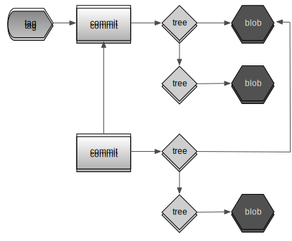

# 3 -- The Git object database

## Example application: waterbug, a simple URL shortener

To illustrate how Git stores its information internally, we will be building a very (_very_) simple URL web application. We will use Ruby to write our very own URL shortener, not unlike popular services like bit.ly, j.mp and t.co. The premise is simple: the user visits a short URL containing a unique key that maps to a longer URL somewhere else on the web. Our application will look up that key and redirect the user.

I have decided to write it using the [Sinatra web framework][sinatra], and I have come up with the following application in `app.rb`:

    require 'sinatra'
    
    get '/:shorturl' do
      redirect Store.fetch(params[:shorturl])
    end
{: lang="ruby" }

I respond to any GET request and capture the path into a `shorturl` parameter. We can then ask a `Store` object to give us a value corresponding to our `shorturl` key.

I need to have some kind of store object to map a short URL to a long URL. After pondering this dilemma for a while, I have come up with the following solution in a new file `lib/store.rb`:

    Store = [
      'http://arjanvandergaag.nl',
      'http://ruby-lang.org'
    ]
{: lang="ruby }

Then, we force our application to use numeric keys by converting our incoming key, which is a string, into an integer:

    require 'sinatra'
    require 'store'

    get '/:shorturl' do
      redirect Store.fetch(params[:shorturl].to_i)
    end
{: lang="ruby" }

My `Store` object can be just a nativ Ruby `Array` object, since it responds to the `fetch` message and returns a value for a key. Works great, doesn't it? One might think of several downsides to using numeric keys, as well as to using an in-memory array as data store, but I think we can all agree on the benefits of taking baby steps.

Our application is fully functional, and we can test it by first making sure we have the `sinatra` gem installed on our system, and the running our app:

    $ gem install sinatra
    Sucessfully installed sinatra-1.3.1
    1 gem installed
    $ ruby -rubygems -Ilib app.rb

Note how we use command-line arguments to the `ruby` program to require Rubygems before running our file, and adding the `lib` directory to the load path, so `require 'store'` will actually find our `./lib/store.rb` file. If all went well, a web server should be launched, serving our application. Open a browser and go to `http://localhost:4567/0` and you will be redirected to `http://arjanvandergaag.nl`. Sweet!

Satisfied with our work, we can now commit our work to the repository. Let's initialize a new repository:

    $ git init .
    Initialized empty Git repository in /Users/arjan/waterbug/.git/
    $ git add .
    $ git commit -m "Initial commit"
    $ git tag 0.0.1 -a -m "Tag first version"

We have first initialized a new Git repository, committed all the files in our current working directory to the repository _and_ created a tag for the first release of our new application. Ignore the exact commands for now, we'll get back to them later. For now, a repository with our files, a commit and a tag will suffice for our purposes.

## Peeking inside the Git object database

In order to get to grips with what Git does and how it does it, we'll start by inspecting the Git object database. The repository database is located at `./.git/objects/`. When we look inside the `.git/objects` directory for a brand new Git repository, it's mostly empty:

    ~/new-repo $ ls .git/objects
    pack  info

The only contents of `.git/objects` are the currently empty `pack` and `info` directories. Let's look at the `.git/objects` directory for our waterbug application, this time using the `tree` command:[^1]

    ~/waterbug $ tree .git/objects
    .git/objects
    ├── 09
    │   └── bca756d335370122589e443ec7056f5de73115
    ├── 16
    │   └── eeba075158415e671795b2339f10843bb28fb3
    ├── 48
    │   └── dd33fbe5b424477f4b44ca98f58aff7b4f727c
    ├── 4c
    │   └── bff340eb407e09e3b94b7a4de88e30546d3b1f
    ├── 73
    │   └── 5cbca8fcbdb2a6a5a365e600c29aa8767251cc
    ├── a8
    │   └── 320d12018d3834d5c1ff9f7cf27b577b518855
    ├── info
    └── pack

    8 directories, 6 files

We can see that our actions created six new directories in `.git/objects`, each containing a single file. The filenames are SHA1 hashes of individual objects, with the first two characters of the hash being used as the directory name for optimization purposes.[^2] So we can see there are actually six objects in our database:

    09bca756d335370122589e443ec7056f5de73115
    735cbca8fcbdb2a6a5a365e600c29aa8767251cc
    48dd33fbe5b424477f4b44ca98f58aff7b4f727c
    4cbff340eb407e09e3b94b7a4de88e30546d3b1f
    a8320d12018d3834d5c1ff9f7cf27b577b518855
    16eeba075158415e671795b2339f10843bb28fb3

These are the files we can peek into. These are in no way magic: they're just compressed plain-text files. We could manually decompress and inspect them, but it turns out Git has a command that can help us with that. `cat-file` can, amongst other things, list the _type_ or the _contents_ of an object from the database. Let's look at the first:

    ~/waterbug $ git cat-file -t 4cbff340eb407e09e3b94b7a4de88e30546d3b1f
    blob

Git informs us we are dealing with a `blob` object. A blob is simply a piece of content --- crudely, a _file_ under version control. You may find a blob's contents unsurprising:

    ~/waterbug $ git cat-file -p 4cbff340eb407e09e3b94b7a4de88e30546d3b1f
    require 'sinatra'
    require 'store'

    get '/:id' do
      redirect Store.fetch(params[:id].to_i)
    end

It's exactly the contents of our `app.rb` file. So a blob is simply the contents of a file, identified by a SHA1 hash of its contents.

Let's go to the next file:

    ~/waterbug $ git cat-file -t 48dd33fbe5b424477f4b44ca98f58aff7b4f727c
    tree

The second object is a `tree` type. The purpose of a tree is best demonstrated with an example, so let's print its contents:

    ~/waterbug $ git cat-file -p 3f24f1babffe20dd7b503ae5e0f21d8497391cfa
   100644 blob 4cbff340eb407e09e3b94b7a4de88e30546d3b1f app.rb
   040000 tree a8320d12018d3834d5c1ff9f7cf27b577b518855 lib

A tree contains a list of references to other objects; both SHA1 hashes are present in the list of objects we saw listed earlier. In addition to the hashes, a tree file also lists the original file attributes, object types and original filename. Note how this tree object refers to another tree object for our `lib` directory. That object will contain a single entry for our `store.rb` file. So, a tree object maps blobs and other trees to files and directories in a working copy. Or, to rephrase, it maps Git objects to filesystem objects.

Let's move on to the next object in our database:

    ~/waterbug $ git cat-file -t 09bca756d335370122589e443ec7056f5de731153
    commit

It is a commit object, and its contents will not surprise you, as you will likely have seen something similar in the output of a `git log` command:

    ~/waterbug $ git cat-file -p 09bca756d335370122589e443ec7056f5de73115
    tree 48dd33fbe5b424477f4b44ca98f58aff7b4f727c
    author Arjan van der Gaag <arjan@kabisa.nl> 1324073506 +0100
    committer Arjan van der Gaag <arjan@kabisa.nl> 1324073506 +0100

    Initial commit

There are several different things going on here. First, the commit object refers to a tree object: the one we saw earlier for the root directory of our project. It then lists commit author, email and date. Finally, it includes the entire commit message we supplied when creating the commit.

A commit object can be seen as a snapshot of the project on a particular point in time. The contents of that snapshot is defined by the root tree the commit refers to. That tree will in turn know about blobs and other trees, so we can completely re-create a working copy from a single commit.

There is one object left in our database, so let's inspect it:

    ~/waterbug $ git cat-file -t 735cbca8fcbdb2a6a5a365e600c29aa8767251cc
    tag

It is an object for the `0.0.1` tag we created. Its contents are similar to a commit object:

    ~/waterbug $ git cat-file -p 735cbca8fcbdb2a6a5a365e600c29aa8767251cc
    object 09bca756d335370122589e443ec7056f5de73115
    type commit
    tag 0.0.1
    tagger Arjan van der Gaag <arjan@kabisa.nl> Fri Dec 16 23:11:53 2011 +0100

    Tagged first version

In a similar format, the tag object records committer name, timestamp and message of the object. It also specifies the tag name as well a reference to an object, which we can quickly recognise as being our first commit. So, a tag object is simply a reference to an existing commits with some added metadata.

To recap, we have seen the following objects in the Git database:

* A *blob* is a piece of content your wrote, usually a file.
* A *tree* is a list of files on disk and their associated blobs.
* A *commit* refers to a tree object as its contents, and specifies metadata such as date, author and message.
* A *tag* which is a simple, named pointer to an existing commit in the database.

## Adding another commit and understanding Git history

We have seen the basic building blocks of the Git object database, but we have not yet seen how commits relate to each other to form a timeline of your project. We have seen how our commits record a snapshot of our project at a given point in time; now let's what happens when we have multiple commits.

In our project directory, let's add another URL to our impressively growing database of shortened URLs:

    # in lib/store.rb
    Store = [
      'http://arjanvandergaag.nl',
      'http://ruby-lang.org',
      'http://rubyonrails.org'
    ]

We will record our change in a new commit:

    ~/waterbug $ git commit -a -m "Added URL to rubyonrails.org"
    [master 8f27176] Added URL to rubyonrails.org
     1 files changed, 2 insertions(+), 1 deletions(-)

When we now look inside the `.git/objects` directory, we can see several new files were added. The first is our new commit:

    ~/waterbug $ git cat-file -p 8f271769adcf159ff31ac590fd695d73b094f00c
    tree 4cf84abe9537e47dbb80b7498cbe46d5415ffaa9
    parent 09bca756d335370122589e443ec7056f5de73115
    author Arjan van der Gaag <arjan@kabisa.nl> 1324118424 +0100
    committer Arjan van der Gaag <arjan@kabisa.nl> 1324118424 +0100

    Added URL to rubyonrails.org

The commit is very similar to the last, except for the addition of the `parent` line. It refers to another Git object, and we can recognise it as our previous commit object. Before elaborating on commit relationships, let's look at the tree object it refers to:

    ~/waterbug $ git cat-file -p 4cf84abe9537e47dbb80b7498cbe46d5415ffaa9
    100644 blob 4cbff340eb407e09e3b94b7a4de88e30546d3b1f    app.rb
    040000 tree b4b61ceee229861f96690c06403947d77775f72a    lib

The root tree object points at the same blob object for our app.rb file --- which has not changed. It refers to a _new_ tree object for the `lib` directory. That, in turn, refers to a new blob object for the `store.rb` file:

    ~/waterbug $ git cat-file -p b4b61ceee229861f96690c06403947d77775f72a
    100644 blob 57075452307e47f140bd8ba180c637b8bc57482d    store.rb

There's a new blob object for the `store.rb` file, since that file _did_ change. Its contents are the exact contents of the modified file:

    ~/waterbug $ git cat-file -p 57075452307e47f140bd8ba180c637b8bc57482d
    Store = [
      'http://arjanvandergaag.nl',
      'http://ruby-lang.org',
      'http://rubyonrails.org'
    ]

What has happened here? We have made three important observations:

1. A commit can refer to a parent commit, forming a _linked list_ of commits and establishing a project history.
2. When a file is changed, a new blob object is added to the database. This new blob is referred to in a new tree object, and the new tree object itself is referred to in a new root tree object. The original blob object remains unchanged.
3. The file that did not change is listed again in the new tree object --- it does not get a new blob object.

It may be worth pausing to discuss why a new tree object is created when one of the files it refers to is changed. We have seen how a change in a file leads to the creation of a new blob object. That blob object is uniquely identified by its hash. So in order to list a new file, a tree object needs to refer to a new hash. That would cause its textual contents to change. Hence, its own hash changes. So, we can never actually _change_ objects in the Git object database, since every change triggers the creation of a new object. We can only _add to_ the database.

Schematically, we can draw the relations in the Git object database like this:

In summary, the history of our project consists of a series of linked commit objects, each representing a snapshot of the contents of the project. A commit object has a tree object to list its files and directories by pointing at other tree and blob objects. A blob object is a file's contents. A tag object is simply a pointer at an existing commit object.

We now understand enough of the basics of the Git object database to move on to a slightly more advanced topic, that is at the same time surprisingly simple yet core to the magic of Git: branching.

[^1]: If you don't have the `tree` command --- Mac OS X does not come with it pre-installed --- then you can compile and install it yourself. On Mac OS X it is simple using Homebrew: `brew install tree`.

[^2]: Git calculates an object's hash by passing the result of concatenating the file type (e.g. `blob`, `tree`, `tag` or `commit`), a space, the file size, a null byte and then the entire file's contents through the SHA1 algorhithm.

*[URL]: Uniform Resource Locator

[sinatra]: http://sinatrarb.com
