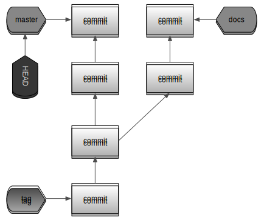

# 4 -- Working with branches, and why they're so cheap

Cheap branching is one of the main selling points of Git. Non-trivial use of branches --- especially when you start working with remote branches --- requires an understanding of how Git actually handles branching, and how Git regards your project's history.

## What makes branching cheap?

Knowing how Git chains commits together to form a history of your project, it is not hard to see how branches work. A commit object refers to a parent commit, which returns to its parent, and so forth until you reach the first commit in the project. But a single commit can obviously be referred to as a parent by two different commits, as in the following example:

    * 0985000 - (HEAD, docs) Added README
    | * 8f27176 - (master) Added URL to rubyonrails.org
    |/  
    * 09bca75 - (0.0.1) Initial commit

Here, I have added a new commit to our waterbug URL shortener application. Both the `0985000` and `8f27176` commits refer to `09bca75` as their parent commit, but they know nothing of each other. We have created two _branches_ of development.

The new branch I have created for my documentation efforts is called `docs` while the main branch is called `master`. These names are mentioned in the log output listed above.

When we go looking at how this information is stored, our first guess might be to start browsing `.git/objects`. The only things you would find there are the new commit, tree and blob objects we created by comitting new changes to the repository. All information regarding branches are not first-class citizens in the Git object database; instead, they reside in `.git/refs`. Let's look inside this directory, again using the `tree` command:

    $ tree .git/refs
    .git/refs
    ├── heads
    │   ├── docs
    │   └── master
    └── tags
        └── 0.0.1

    2 directories, 3 files

We see two directories, together containing three files with familier names: `docs`, `master` and `0.0.1`. Let's ignore the `tags` directory for now, and focus on `.git/refs/heads`. Git uses this directory to store all the information it needs on all the branches that exist in the project. It keeps a file for every banch, in this case just `docs` and `master` --- although in real-world projects this directory will probably contain many more files.

While Git objects are stored with file types, sizes, hashes and deflation, these files are simply stored as plain text. Let's peek at their contents:

    ~/waterbug $ cat .git/refs/heads/docs
    0985000564743153b0167c56c371036629952162

That's it. The `docs` file contains just the hash of the latest commit on the `docs` branch. It makes sense when you think of it: branching into different directions is a very simple consequence of the linked-list model of commits that Git uses. Have two commits refer to the same commit as their parent, and you've got branches. All Git needs to record on top of that, is a name of a branch (the name of a file in `.git/refs/heads`) and the current _tip_ (latest commit) of that branch (the contents of that file in `.git/refs/heads`).

With this knowledge, it is time we cleared up our nomenclature a bit:

Branch
:   A chain of commits that shares a common ancestor with another chain of commits.

Ref
:   A ref (or _reference_) is a named pointer to an existing Git object -- usually a commit. This is basically the name of a branch.

Tip
:   A branch _tip_ is the latest commit in a branch.

It is important to make a distinction between a _branch_ as a chain of commits, and a _ref_ naming a partical chain of commits as a branch. Take the `git branch` command: you can use it to list, create or remove branches. But actually, you use it to list, create and remove _references to branches_. Let's illustrate with an example:

    ~/waterbug $ find .git/objects -type f | wc -l
    13
    ~/waterbug $ git branch foo
    ~/waterbug $ ls .git/refs/heads
    docs  foo   master
    ~/waterbug $ find .git/objects -type f | wc -l
    13

Using the programs `find` and `wc` we count the total number of files in the `.git/objects` directory and all its subdirectories. When we  create a new branch, nothing in our actual repository contents has changed. `git branch foo` has only created a single file for us in `.git/refs/heads` called `foo` with a hash as its contents. Removing a branch is does exactly what you'd expect:

    ~/waterbug $ git branch -d foo
    Deleted branch foo (was 0985000).
    ~/waterbug $ ls .git/refs/heads
    docs  master

Using `git branch rm` to delete a branch has simply deleted the _reference_, not the actual _branch_ (the commits that that branch contained). That is why branching in Git is so fast and simple: branches are just named commit pointers and nothing more.

## The abandoned commit

You now might wonder what would happen if we removed the `docs` branch. Since branches are really just commit pointers, we should be able to safely remove them, no? Let's checkout the `master` branch, and then try to remove the `docs` branch:

    ~/waterbug $ git checkout master
    Switched to branch 'master'
    ~/waterbug $ git branch -d docs
    error: The branch 'docs' is not fully merged.
    If you are sure you want to delete it, run 'git branch -D docs'.

Git helpfully informs us that the branch we were about to delete contains commits that are not yet part of any other branch -- that is to say, if you follow the ancestry of any other branch, in this case only `master`, all they way back to the project's first commit, you would not encounter some of the commits that are in `docs`. So, it appears we will actually lose commits when we remove an unmerged branch. But, as we like a challenge, we will force Git to delete the branch anyway, to see what happens:

    ~/waterbug $ git branch -D docs
    Deleted branch docs (was 0985000).
    ~/waterbug $ git log --decorate --oneline
    8f27176 (HEAD, master) Added URL to rubyonrails.org
    09bca75 (tag: 0.0.1) Initial commit

Clearly, the commits from our deleted branch no longer show up in the log output. But have they been deleted? Note that Git told us the branch we deleted `was 0985000`... let's check it out, literally:

    ~/waterbug $ git checkout 0985000
    Note: checking out '0985000'.

    You are in 'detached HEAD' state. You can look around, make experimental
    changes and commit them, and you can discard any commits you make in this
    state without impacting any branches by performing another checkout.

    If you want to create a new branch to retain commits you create, you may
    do so (now or later) by using -b with the checkout command again. Example:

          git checkout -b new_branch_name

    HEAD is now at 0985000... Added README

Despite the scary message Git prints out, we are actually back on the commit that used to be the tip of the the `docs` branch. So deleting the branch has indeed not deleted any of its contents -- just the reference has been removed.

This is where things get tricky, because this might give you a false sense of security. The `0985000` commit is now considered by Git to be 'abandoned', as it is no longer included in any branch. Git will occasionally clean up and optimize its object database, and abandoned commits _will be removed_, or _pruned_ it Git parlance. This is a good thing, so just don't depend on these abandoned commits staying around. For now, however, it is nice to know that the objects we thought we removed are actually still around.

The message Git printed explained to us how we might create a new branch at the current commit, so let's do that to restore our `docs` branch:

    ~/waterbug $ git checkout -b docs
    Switched to a new brach 'docs'

We could have achieved the same result by skipping the `git checkout 0985000` step and just calling `git branch` directly:

    ~/waterbug $ git branch docs 0985000

This would have kept the `master` branch checkout out, but created the `docs` branch at the specified commit.

In this case, it was obvious what commit to create our new branch at. If for some reason you missed that information, you could always use the _reflog_ to look it up using `git reflog`. The reflog is a log of all operations on your local repository, and it would have included an entry listing the hash and message of the `0985000` commit. We will return to the reflog in more detail in a later chapter.

## Mind your `HEAD`

There is one last piece of the branching puzzle missing: how does Git know what branch is currently checked out? If you make some changes and record a new commit, what commit should it refer to as its parent? There is nothing stored in `.git/refs` to could tell us this, but there is the `.git/HEAD` file:

    ~/waterbug $ cat .git/HEAD
    ref: refs/heads/docs

The `.git/HEAD` file is used by Git to track the currently checked out branch -- although, as we have seen in our previous example with the "detached HEAD state" this is not necessarily always a branch. Because `HEAD` currently points at the `docs` branch, any new commit we would now create, would record the tip of `docs` as its parent commit. Or, in simper terms, any commit right now would be made on the `docs` branch.

One might wonder why Git would not simply record a commit object in the `HEAD` file, as branches do. To explain why it doesn't, imagine the following scenario. You have the `master` branch currently checked out, and you want to start working on documentation. You create the new `docs` branch using `git branch docs` and you add the README file, as we have in the example. What would happen if you make a new commit? Had Git only recorded the current commit as `HEAD`, there would be no way for Git to know if the new commit was to advance the `master` branch or the `docs` branch, as they both point at the same commit object. Only by explicitly listing the current branch in `.git/HEAD`, is Git able to tell which branch to advance. Therefore, we can conclude that making a new commit does two things:

1. Record a new commit with the tip of the current branch as its parent.
2. Update the current branch reference to point to the new tip.

Schematically, we may draw Git's branching model as follows:

In summary, we have made the following observations:

1. Branches are simple pointers at existing commits. In Git, every commits belongs to a branch.
2. `HEAD` points at the current state of our working copy and usually points at a branch.
3. `HEAD` might point directly at a commit, which is considered a `detached HEAD state`. Should you make a new commit, that commit will be recorded as its parent, but it will not belong to any branch.
3. Commits that do not belong to any branch are considered abandoned and will sooner or later be pruned. Until they are, however, they can still be checked out, manipulated and even be made the tip of a new branch, _unabandoning_ them.
